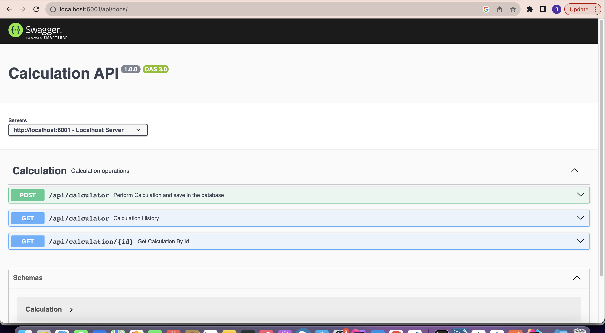

## Calculation API
Calculation API built in Express.js,  Node.js and MongoDB

## Features
- Perform basic calculations
- calculations saved in a mongodb
- Fetch all calculations
- Fetch a calculation

## Setup
Clone this repository to your machine and run `npm install` to install all the dependencies.

Copy `.env.example` and rename it as `.env`

Run Prettier
`npm run prettier`

Run Eslint
`npm run lint`

The API is now running. Copy the url link provided and paste it on your favourite
browser. It should look like `http://127.0.0.1:6001` this will display laravel default landing page.

To view Swagger documentation please navigate to `http::localhost:6001/api/docs`

## Testing
This API contains test cases for all the features named above. Run `run npm test` to run tests.

### Technologies
- Express
- Nodejs
- Swagger

